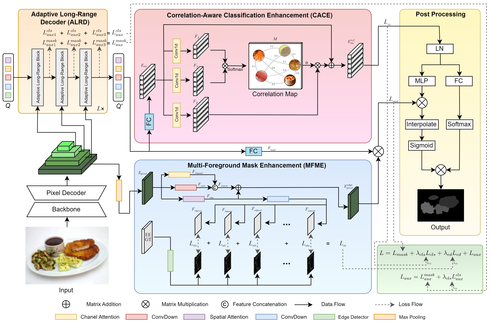

# DEMaskNet: A Dual Enhanced Mask Network for Food Semantic Segmentation


This is the official implementation of the paper "[DEMaskNet: A Dual Enhanced Mask Network for Food Semantic Segmentation]". 
The source code will be made publicly available upon the paper's acceptance.

---

We propose the Dual Enhanced Mask Network (DEMaskNet), a novel framework specifically designed for food semantic segmentation. DEMaskNet builds upon existing mask segmentation technologies and introduces two key advancements. First, it enhances boundary delineation during mask proposal generation by integrating enhanced edge information as supervision, enabling accurate segmentation in complex multi-foreground scenes. Second, it refines the classification process by effectively modeling relationships among food items, improving overall segmentation accuracy. Furthermore, an optimized decoder is incorporated to improve inference performance, achieving superior results while reducing computational complexity compared to traditional Transformer-based decoders. 
  

Our DEMaskNet architecture mainly is composed of several comonents: the backbone, the pixel decoder, the Multi-Foreground
 Mask Enhancement (MFME), the Adaptive Long-Range (ALR) Decoder, the Correlation-Aware Classification Enhancement (CACE) and
 the post-rocessing stage. The MFME module is designed to enhance the accuracy of mask proposals, while the CACF module focuses on
 enhancing mask classification accuracy. Furthermore, the ALR Decoder enables the model to effectively capture long-range dependencies,
 contributing to more robust segmentation performance.

  

## Installation

Please follow our [installation.md](installation.md) to install.


## <a name="GettingStarted"></a>Getting Started

### Train & Evaluation
To train a model with "train_net.py", use
```
python train_net.py  --config-file /path/to/config
```
To evaluate a model's performance, use
```
python train_net.py --config-file /path/to/config --eval-only MODEL.WEIGHTS /path/to/checkpoint_file
```

## Quantitative results

<table>
  <tr>
    <th rowspan="2">Method</th> 
    <th colspan="3">FoodSeg103</th> 
    <th colspan="3">UECFoodPixComplete</th> 
    <th colspan="3">Food50Seg</th> 
  </tr>
  <tr>
    <td>mIou</td>
    <td>mAcc</td>
    <td>aAcc</td>
    <td>mIou</td>
    <td>mAcc</td>
    <td>aAcc</td>
    <td>mIou</td>
    <td>mAcc</td>
    <td>aAcc</td>
  </tr>


  <tr>
    <td>Mask2Former</td>
    <td> 51.37</td>
    <td> 85.91</td>
    <td>62.85 </td>
    <td>68.39</td>
    <td>89.34</td>
    <td>78.68</td>
    <td>92.77</td>
    <td>96.45</td>
    <td>96.17</td>
  </tr>

  <tr>
    <td>DEMaskNet</td>
    <td> 52.87</td>
    <td>86.12</td>
    <td>64.39</td>
    <td>70.12</td>
    <td> 89.78</td>
    <td> 81.32</td>
    <td>93.32</td>
    <td>96.70</td>
    <td>97.74</td>
  </tr>
</table>

The data in the table is still subject to updates.


## License

The model is licensed under the [Apache 2.0 license](LICENSE).

## Citation

We will provide the citation after the paper is published.
